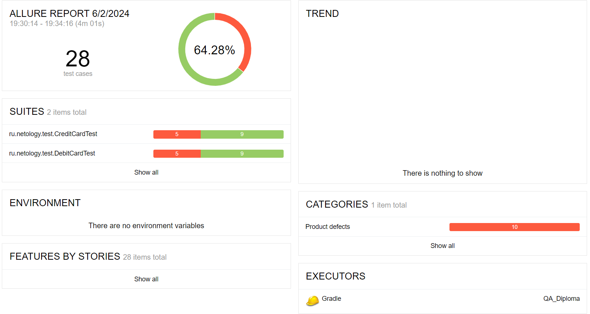

# Отчет по итогам тестирования

При выполнении дипломной работы был протестирован функционал веб-сервиса по покупке тура по дебетовой карте и покупке тура в кредит.  

Всего было проведено 28 тестов, из них:

* успешных - 18
* неуспешных -10

После проведенных тестов были составлены баг-репорты к проекту на github.

## Общие рекомендации
1. Устранить дефекты, выявленные в результате тестирования в соответствии с баг-репортами.
2. Составить документацию по проекту с подробным описанием функционала.

